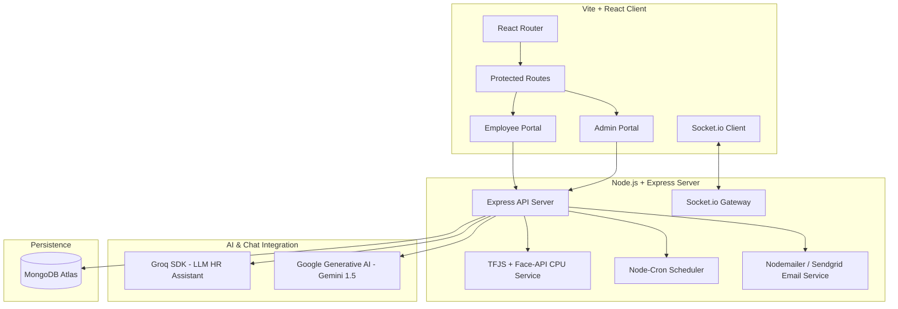
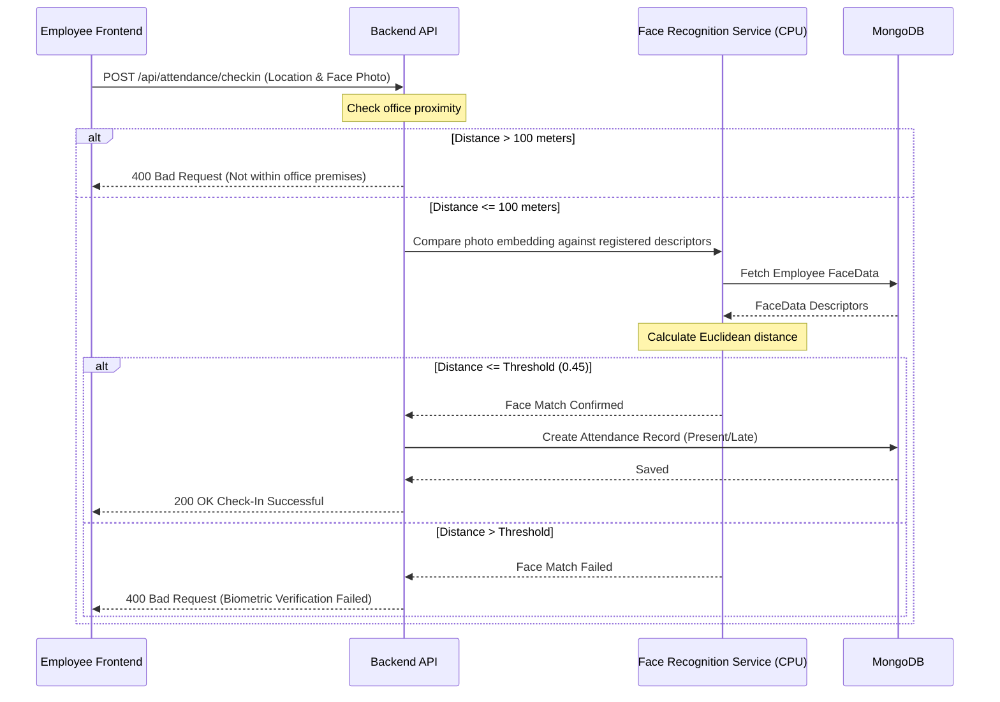

# Employee Management System (EMS) - System & Workflow Documentation

Welcome to the Employee Management System (EMS) project documentation. This guide provides a complete, top-to-bottom overview of the codebase architecture, database models, core business workflows, security models, and API endpoints.

---

## 🗺️ System Architecture

The application is structured as a decoupled client-server system:



### Technical Stack Summary

*   **Frontend**: React (Vite-powered), TailwindCSS, Socket.io-client, React Router DOM, React Hot Toast.
*   **Backend**: Node.js, Express, MongoDB (Mongoose), Socket.io.
*   **AIs & LLMs**: Groq SDK (HR Bot), `@google/generative-ai` (Gemini 1.5 Flash).
*   **Biometrics**: `face-api.js` monkey-patched with Node `canvas` + `@tensorflow/tfjs` (CPU backend).
*   **Mailing & Scheduling**: `nodemailer` (SMTP app-specific passwords) & `node-cron`.
*   **Document Generation**: `pdfkit` (on-the-fly salary slip and appraisal letter generation).

---

## 🗃️ Database Schemas & Models

The MongoDB database consists of 18 core schemas defined in [backend/models](file:///e:/Codes/TarunaEMS-main/face-main/backend/models):

| Model | File Link | Description | Major Fields |
| :--- | :--- | :--- | :--- |
| **User** | [User.js](file:///e:/Codes/TarunaEMS-main/face-main/backend/models/User.js) | Stores core login credentials and authentication roles. | `name`, `email`, `password` (hashed), `role` (`admin`/`employee`), `isActive` |
| **Employee** | [Employee.js](file:///e:/Codes/TarunaEMS-main/face-main/backend/models/Employee.js) | Contains exhaustive profile, bank details, documents, and work history. | `personalInfo`, `bankDetails`, `documents`, `workInfo` (designation, salary, department), `status` |
| **Attendance** | [Attendance.js](file:///e:/Codes/TarunaEMS-main/face-main/backend/models/Attendance.js) | Daily attendance records, timing details, and coordinates. | `employee`, `date`, `checkInTime`, `checkOutTime`, `checkInLocation`, `checkOutLocation`, `status`, `isLate` |
| **Department** | [Department.js](file:///e:/Codes/TarunaEMS-main/face-main/backend/models/Department.js) | Departments definition. | `name`, `code`, `description`, `manager` |
| **Task** | [Task.js](file:///e:/Codes/TarunaEMS-main/face-main/backend/models/Task.js) | Work assignments and tracker. | `title`, `description`, `assignedTo`, `priority`, `status`, `estimatedHours`, `dueDate` |
| **Leave** | [Leave.js](file:///e:/Codes/TarunaEMS-main/face-main/backend/models/Leave.js) | Employee time-off requests. | `employee`, `leaveType`, `startDate`, `endDate`, `status` (`Pending`/`Approved`/`Rejected`), `reason` |
| **Holiday** | [Holiday.js](file:///e:/Codes/TarunaEMS-main/face-main/backend/models/Holiday.js) | Company-wide holidays calendar. | `title`, `date`, `description` |
| **Lead** | [Lead.js](file:///e:/Codes/TarunaEMS-main/face-main/backend/models/Lead.js) | Sales/CRM leads database. | `name`, `company`, `email`, `phone`, `status`, `value`, `assignedTo`, `activities`, `communicationLog` |
| **Supplier** | [Supplier.js](file:///e:/Codes/TarunaEMS-main/face-main/backend/models/Supplier.js) | Vendor directory for purchasing. | `name`, `contactPerson`, `email`, `phone`, `address` |
| **PurchaseOrder** | [PurchaseOrder.js](file:///e:/Codes/TarunaEMS-main/face-main/backend/models/PurchaseOrder.js) | Inventory purchase workflow. | `orderNumber`, `supplier`, `items` (name, quantity, cost), `totalAmount`, `status`, `paymentTerms` |
| **DayBook** | [DayBook.js](file:///e:/Codes/TarunaEMS-main/face-main/backend/models/DayBook.js) | Expense registry and petty cash ledger. | `date`, `type` (`Cash In` / `Cash Out`), `amount`, `description`, `submittedBy`, `receiptUrl` |
| **Message** | [Message.js](file:///e:/Codes/TarunaEMS-main/face-main/backend/models/Message.js) | Individual direct messages. | `sender`, `recipient`, `text`, `createdAt` |
| **Group** | [Group.js](file:///e:/Codes/TarunaEMS-main/face-main/backend/models/Group.js) | Real-time chat channels/groups. | `name`, `description`, `members` (user + role), `isGroup` |
| **GroupMessage** | [GroupMessage.js](file:///e:/Codes/TarunaEMS-main/face-main/backend/models/GroupMessage.js) | Chat messages sent inside groups. | `group`, `sender`, `text`, `createdAt` |
| **FaceData** | [FaceData.js](file:///e:/Codes/TarunaEMS-main/face-main/backend/models/FaceData.js) | Stores facial embeddings for biometric check-in. | `employee`, `descriptors` (2D arrays of coordinates), `label`, `createdAt` |
| **Payslip** | [Payslip.js](file:///e:/Codes/TarunaEMS-main/face-main/backend/models/Payslip.js) | Historical salary slips. | `employeeId`, `employeeName`, `period` (month, year), `earnings`, `deductions`, `netSalary`, `pdfUrl` |
| **Problem** | [Problem.js](file:///e:/Codes/TarunaEMS-main/face-main/backend/models/Problem.js) | Employee grievance and bug reports. | `title`, `description`, `submittedBy`, `status` (`Open`/`In Progress`/`Resolved`) |
| **Notification** | [Notification.js](file:///e:/Codes/TarunaEMS-main/face-main/backend/models/Notification.js) | In-app notification triggers. | `user`, `title`, `message`, `type`, `read` |

---

## ⚡ Core Workflows & Logic

### 1. Security & Route Protection
Access control operates on two dimensions: **System Roles** and **Employee Departments**.

*   **Role Authentication**: JWT tokens are signed at login and saved in `localStorage` or `sessionStorage`. Check-in requires this token in the header.
*   **Frontend Routing Guard**: [ProtectedRoute.jsx](file:///e:/Codes/TarunaEMS-main/face-main/frontend/src/routes/ProtectedRoute.jsx) restricts views:
    *   `admin` is redirected to `/admin/dashboard`
    *   `employee` is redirected to `/employee/dashboard`
*   **Department Module Restrictions**: Contained in [departmentAccess.js](file:///e:/Codes/TarunaEMS-main/face-main/frontend/src/utils/departmentAccess.js). Employees are blocked from modules unless they belong to authorized departments:
    *   **BDE / Sales / Business Development**: Authorized to view the `sales` module (`/employee/sales`, `/employee/leads`) and `tasks`.
    *   **Developer / Development**: Authorized to access `tasks` and `problems` (bug submission).
    *   **Designing**: Authorized to access `tasks`.
    *   **Common (All Employees)**: Authorized to access `dashboard`, `attendance`, `leaves`, and `holidays`.

---

### 2. Biometric Attendance (Face & Geolocation)
The attendance flow in [attendanceController.js](file:///e:/Codes/TarunaEMS-main/face-main/backend/controllers/attendanceController.js) enforces strict validation for check-ins:



*   **Office Geofence Boundary**:
    ```javascript
    export const OFFICE_LOCATION = {
      latitude: 22.298873262930066,
      longitude: 73.13129619568713,
      radius: 100 // strict office location enforcement in meters
    }
    ```
*   **Face Check Logic**:
    *   **Frontality symmetry validation**: Analyzes eye-to-nose horizontal symmetry and tilt alignment ratios.
    *   **Face quality metric**: Enforces minimum face dimensions (must occupy 20% to 80% of width) and centers within a 30% bounding offset.
    *   **Descriptor verification**: Performs Euclidean distance matching against average embeddings.

---

### 3. Automated Daily Task Status Reports
Schedules daily task report mailings to **tarunatechnology@gmail.com** using [taskSchedulerService.js](file:///e:/Codes/TarunaEMS-main/face-main/backend/services/taskSchedulerService.js):

*   **Time Schedules (IST timezone - Asia/Kolkata)**:
    *   `12:05 PM IST` (cron: `5 12 * * *`)
    *   `12:10 PM IST` (cron: `10 12 * * *`)
    *   `12:15 PM IST` (cron: `15 12 * * *`)
*   **Workflow**:
    1.  Cron wakes up -> queries active database employees.
    2.  For each employee, collects assigned tasks and status breakdowns (Not Started, In Progress, Review, Completed, On Hold, Cancelled).
    3.  Generates a polished HTML table formatting names, tasks, priority, due dates, and hour estimates.
    4.  Mails the report on behalf of the employee (Setting `From` display and `Reply-To` headers to employee details, but authenticating via the admin SMTP account credentials).

---

### 4. Interactive HR Assistant AI (Groq & Gemini)
The platform integrates advanced generative text capabilities for both Admins and Employees:

*   **HR LLM Chatbot (Groq SDK)**: Located in [botController.js](file:///e:/Codes/TarunaEMS-main/face-main/backend/controllers/botController.js):
    *   **Admin HR Assistant**: Possesses full database read-privileges. Can summarize employee directory details, calculate average salaries by department, audit attendance, or review pending leaves.
    *   **Employee HR Assistant**: Secured to scope answers *only* to the logged-in user's leave balance, attendance history, and salary details.
    *   **Dynamic Document Generation**: If the chatbot detects a request for an appraisal letter or salary slip, it responds with token actions `[GENERATE_SALARY_SLIP]` or `[GENERATE_APPRAISAL_LETTER]`. The controller automatically calls `pdfkit` to generate the PDF and streams it to the user.
*   **System Help AI (Google Gemini)**: Located in [aiController.js](file:///e:/Codes/TarunaEMS-main/face-main/backend/controllers/aiController.js):
    *   Provides user guidance, operational instructions, and explains system features using the `gemini-1.5-flash` model.

---

### 5. Sales & Leads Pipeline (CRM)
For the Business Development team:
*   Leads are registered, updated, and tracked through a pipeline (New, Contacted, Proposal Sent, Negotiation, Won, Lost).
*   Tracks deal value, pipeline source, activity logs, and follow-up communication tasks.
*   Admin dashboard compiles conversion rates, total pipeline values, source analytics, and employee sales rankings.

---

### 6. Petty Cash Ledger (Day Book)
*   Submits physical receipts alongside transaction logs (Cash In / Cash Out).
*   Enforces double-entry audit records.
*   Requires Admin approval before completing logs.

---

## 🛠️ Local Configuration

### Key Environment Variables (`backend/.env`)

```ini
# MongoDB Connection
MONGODB_URI=mongodb+srv://...

# Server configuration
PORT=3001
JWT_SECRET=your-super-secret-jwt-key-here
JWT_EXPIRE=30d

# Mail SMTP Credentials (Gmail App Password)
EMAIL_HOST=smtp.gmail.com
EMAIL_PORT=587
EMAIL_USER=your-email@gmail.com
EMAIL_PASS=your-app-password
ADMIN_SYSTEM_EMAIL=your-system-email@gmail.com
ADMIN_SYSTEM_PASSWORD=your-system-app-password

# AI & LLM Integrations
GROQ_API_KEY=your-groq-api-key
GOOGLE_AI_API_KEY=your-google-api-key
```

### Launch commands

```bash
# Start backend service (Runs on http://localhost:3001)
cd backend
npm run dev

# Start React web client (Runs on http://localhost:5000)
cd frontend
npm run dev
```

---

> [!NOTE]
> All core routes require a Bearer token verification except `/api/auth/login`, `/api/auth/register`, and password reset endpoints.
